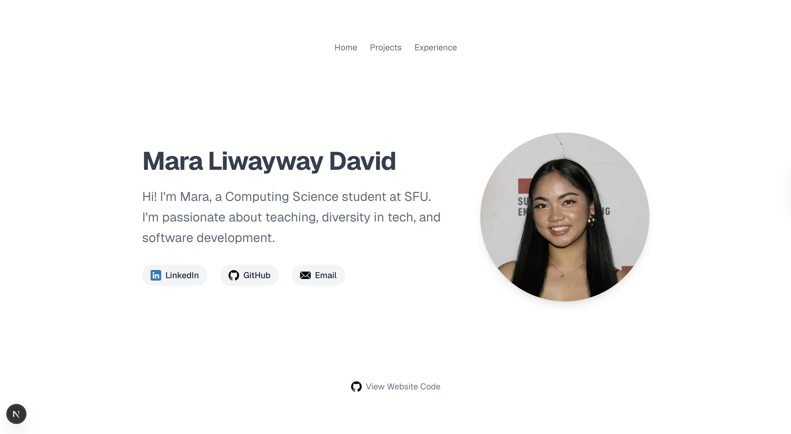
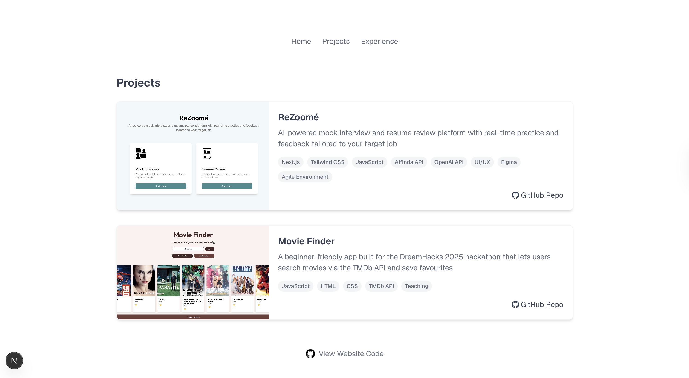
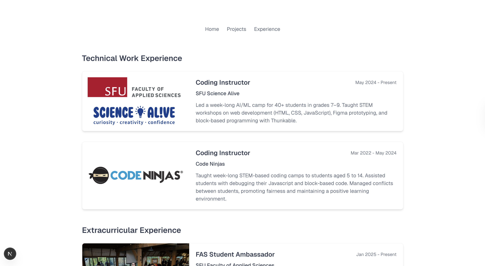

# Portfolio

*Figure 1. Homepage*


*Figure 2. Projects section*


*Figure 3. Experience section*

Welcome to my portfolio! This site is a curated collection of my projects and experiences.

## Technologies Used
- Next.js with JavaScript
- Tailwind CSS

## Future Improvements
- [ ] Toggable dark and light mode
- [ ] In-depth documentation for my projects
- [ ] Simple animations 
- [ ] Double check accuracy of alt text for accessibility
- [ ] Add more projects and experiences as I go
- [ ] Conduct usability tests to gauge future improvements
- [ ] Experiment with more unique or interactive design elements
- [ ] Add more sections, such as an about me or interests section

## How to Run
You can view my portfolio [here](https://www.maraliwayway.com/) or run a clone of this repository on your local device.
1. Clone this repository
2. Navigate to the repository's directory, and run `npm install`
3. Next, run the development server:

```bash
npm run dev
# or
yarn dev
# or
pnpm dev
# or
bun dev
```
4. Open [http://localhost:3000](http://localhost:3000) (if not occupied already) with your browser to see the result!
